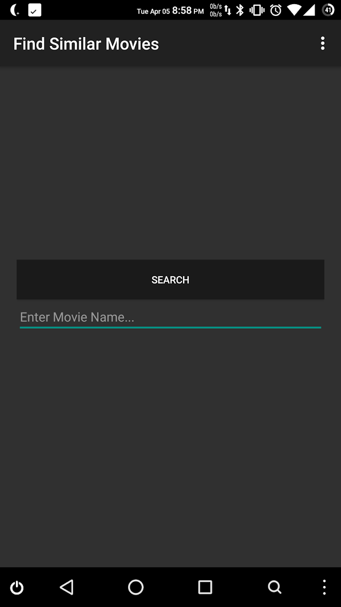
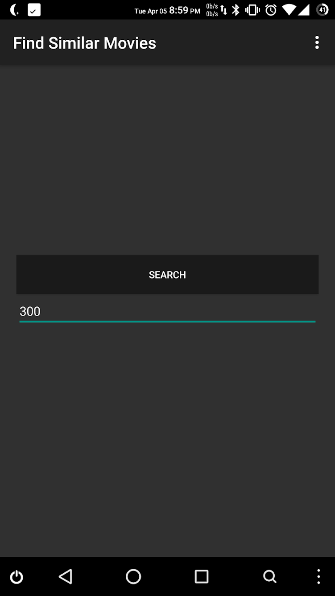
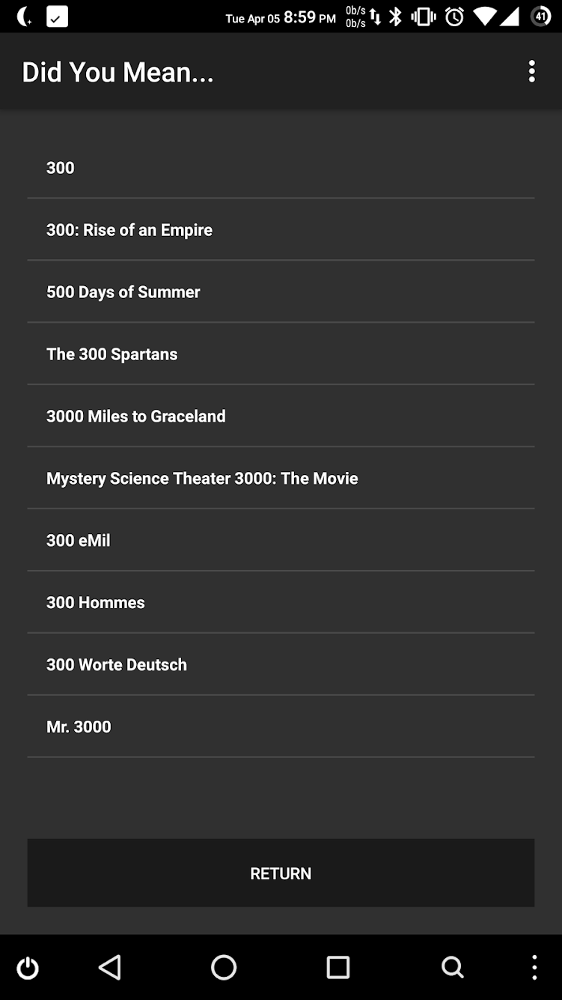
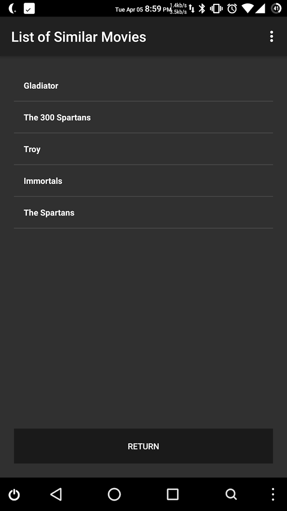
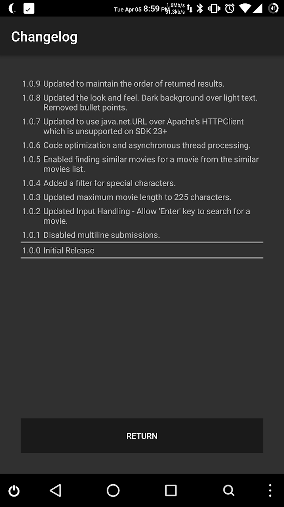
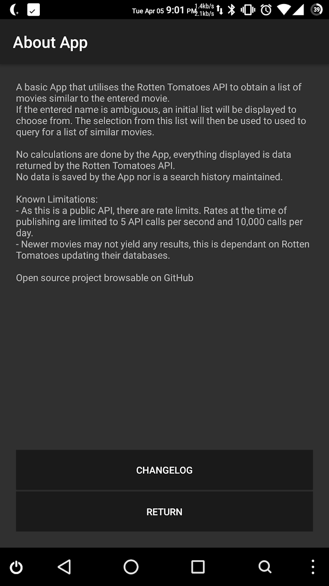

# SimilarMovies

<b>NOTE:</b> This project is no longer being mantained. RottenTomatoes has updated their API to be "purchase only" via a Business Proposal form.

---

 
 
 
 
 

## Find Similar Movies

 An App that makes use of the RottenTomatoes API to search for movies similar to a given movie.

### Usage

 <table align="center">
  <tr align="center">
    <td><b>Home</b></td>
    <td><b>Search</b></td>
    <td><b>Sort</b></td>
    <td><b>Found!</b></td>
  </tr>
  <tr>
    <td valign="top"></td>
    <td valign="top"></td>
    <td valign="top"></td>
    <td valign="top"></td>
  </tr>
 </table>
 
  <table align="center">
  <tr align="center">
    <td><b>Changelog</b></td>
    <td><b>About</b></td>
  </tr>
  <tr align="center">
    <td valign="top"></td>
    <td valign="top"></td>
  </tr>
 </table>

